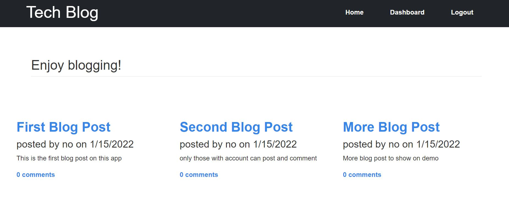

# Tech_Blog

This application will display set of blog posts create by user who sign up an account. User who sign in their account can create a new post, edit thier own post, and delete their post. They can also post comment on any blog post and delete any comment. There are few things need to improve. First, user should only able to delete comments that they created. Second, the design for this website can look more chic and up to date. Lastly, user should be able to edit thier oen comment as long as they logged in.

#### The app look like the following

## Deployed Application
[Link to App](https://tech-blog-maggie.herokuapp.com/)

## Built With
* Javascript
* HTMl
* CSS

## License
Licensed under the MIT license.

